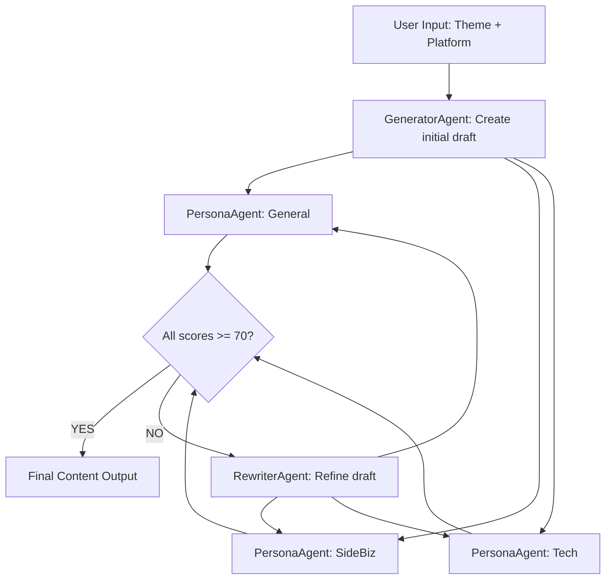

# 🤖 Multi-Persona Content PDCA Agent

> AI-powered content quality assurance system that automatically refines social media posts until all target personas approve.

[](https://pdca-agent.proudcliff-2784d2f4.eastus2.azurecontainerapps.io)
[](https://github.com/hiiirano/multi-persona-pdca-agent/actions/workflows/deploy.yml)
[](LICENSE)

---

## 🎯 Problem

Writing social media content that resonates with diverse audiences is hard. A post that excites tech enthusiasts may confuse general readers. A post targeting entrepreneurs may feel too salesy for technical audiences.

**This agent solves it automatically** — by running your draft through 3 AI personas in parallel, collecting structured feedback, and rewriting until everyone approves.

---

## ✨ How It Works



### Agent Roles

| Agent | Role |
|---|---|
| **GeneratorAgent** | Creates the initial content draft tailored to the platform format |
| **PersonaAgent_General** | Evaluates from a casual reader's perspective (clarity, shareability) |
| **PersonaAgent_SideBiz** | Evaluates from an entrepreneur's perspective (actionability, motivation) |
| **PersonaAgent_Tech** | Evaluates from a technical expert's perspective (accuracy, credibility) |
| **RewriterAgent** | Rewrites the draft based on failing personas' feedback |

Each persona returns a **score (0–100)** and structured feedback. The PDCA loop runs up to 3 times until all scores reach ≥ 70.

---

## 🖥️ Demo

**Live App:** https://pdca-agent.proudcliff-2784d2f4.eastus2.azurecontainerapps.io

### Example Flow

1. Enter theme: `"Complete Roadmap to Earning $100K with AI"`
2. Select platform: `𝕏 (Twitter)`
3. Watch 3 personas evaluate in parallel
4. See the rewriter auto-refine based on feedback
5. Copy the final approved tweets individually

---

## 🏗️ Architecture

```
┌─────────────────────────────────────────────────────────┐
│                    Streamlit Web UI                      │
│              (Azure Container Apps)                      │
└───────────────────┬─────────────────────────────────────┘
                    │
┌───────────────────▼─────────────────────────────────────┐
│              PDCA Orchestrator (main.py)                 │
│         Microsoft Agent Framework / AutoGen              │
├──────────┬──────────────┬──────────────┬────────────────┤
│Generator │ Persona      │ Persona      │ Persona        │
│Agent     │ General      │ SideBiz      │ Tech           │
├──────────┴──────────────┴──────────────┴────────────────┤
│              RewriterAgent                               │
└───────────────────┬─────────────────────────────────────┘
                    │
┌───────────────────▼─────────────────────────────────────┐
│         Azure AI Foundry / GPT-4o                        │
│              (Azure OpenAI Service)                      │
└─────────────────────────────────────────────────────────┘
```

---

## 🛠️ Tech Stack

| Component | Technology |
|---|---|
| Multi-Agent Framework | **Microsoft Agent Framework (AutoGen / Magentic-One)** |
| LLM | **GPT-4o via Azure AI Foundry** |
| Web UI | **Streamlit** |
| Deployment | **Azure Container Apps** |
| CI/CD | **GitHub Actions** |
| Container Registry | **Azure Container Registry** |

### Hackathon Requirements

- ✅ **Microsoft AI Foundry** — GPT-4o deployed via Azure AI Foundry
- ✅ **Microsoft Agent Framework** — AutoGen multi-agent orchestration
- ✅ **Azure Deployment** — Running on Azure Container Apps
- ✅ **GitHub Development** — Public repo + GitHub Actions CI/CD

---

## 🚀 Local Development

### Prerequisites

- Python 3.11+
- Azure OpenAI deployment (GPT-4o)

### Setup

```bash
git clone https://github.com/hiiirano/multi-persona-pdca-agent
cd multi-persona-pdca-agent

python -m venv .venv
source .venv/bin/activate

pip install -r requirements.txt

cp .env.example .env
# Edit .env with your Azure OpenAI credentials
```

### Run

```bash
streamlit run app.py
```

Open http://localhost:8501

---

## 📁 Project Structure

```
├── app.py                    # Streamlit UI
├── src/
│   ├── main.py               # PDCA orchestrator
│   ├── config.py             # Azure credentials loader
│   └── agents/
│       ├── generator_agent.py
│       ├── persona_agent.py
│       ├── rewriter_agent.py
│       └── prompts/          # Persona system prompts
├── Dockerfile
├── .github/workflows/
│   └── deploy.yml            # CI/CD to Azure Container Apps
└── requirements.txt
```

---

## 🌐 Supported Platforms

| Platform | Format |
|---|---|
| **𝕏 (Twitter)** | Thread (3–5 tweets, numbered) |
| **note.com** | Article with headings + CTA |
| **KDP / Amazon** | Book description (~400 chars) |

---

## 👤 Author

**hiiirano** — Built for Microsoft AI Dev Days Hackathon 2026

Microsoft Learn username: hiiirano
